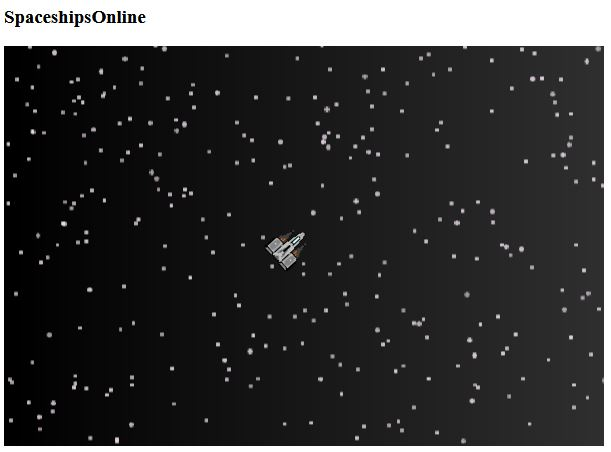

# SpaceshipsOnline

SpaceshipsOnline is a simple multiplayer space game implemented from scratch with Node.JS and Socket.io. Both client and server are written in Typescript. We use browserify to bundle the client into a javascript file. We use ESLint and prettier to keep the code clean.



I was inspired to write this game after reading excellent articles by [Glenn Fiedler](https://gafferongames.com/) and Yahn W. Bernier:
- [Networked Physics](https://gafferongames.com/post/networked_physics_2004/)
- [What Every Programmer Needs To Know About Game Networking](https://gafferongames.com/post/what_every_programmer_needs_to_know_about_game_networking/)
- [Snapshot Interpolation](https://gafferongames.com/post/snapshot_interpolation/)
- [Latency Compensating Methods](https://developer.valvesoftware.com/wiki/Latency_Compensating_Methods_in_Client/Server_In-game_Protocol_Design_and_Optimization)

# Setup
- Install [node.js](https://nodejs.org/en/download/) and NPM
- In the root directory, run `npm install`

# Build

For now, I just wrote several scripts in `package.json`. These scripts are made cross-platform through the shx NPM package. 
- `npm run lint`: Run the linter and quietly fix any fixable warnings
- `npm run clean`: Deletes the `dist` folder, if it exists
- `npm run pre-build`: Creates the `dist` folder structure
- `npm run build-server`: Use `tsc` to transpile the server code. *Also copies the `assets` folder into `dist`*
- `npm run build-client`: Use `tsc` and `browserify` to transpile the client code and package it into a single Javascript file

I often combine these commands for convenience:
```
npm run clean && npm run pre-build && npm run build-server && npm run build-client && npm start
```

This will create a `dist` folder with the following structure:
- `server`: transpiled server code
- `shared`: transpiled "shared" code used by the server
- `assets`: assets (e.g. images) used by the client
- `client`: transpiled client code (contains "client.js")
- `index.html`: the HTML file served by the backend. Simply creates an HTML5 canvas and loads the `client/client.js` script from the server

# Run
In the root directory, run `npm start`

You can now join the game at [http://localhost:8081](http://localhost:8081) 

